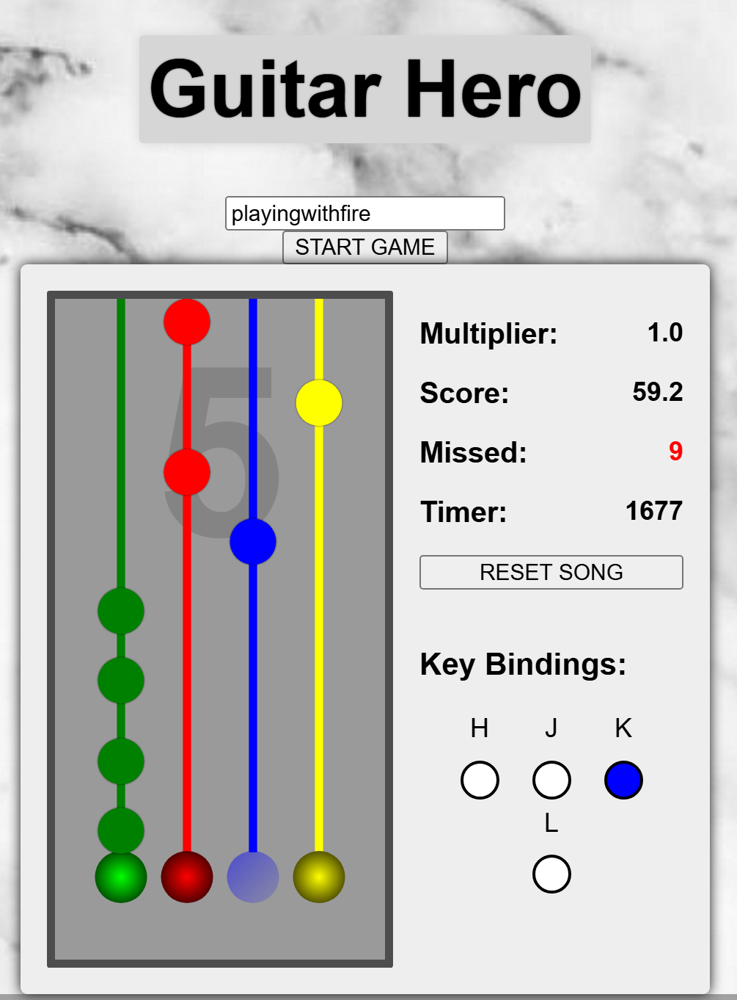

# Guitar Hero FRP

Author: **Aaron**

Guitar Hero FRP is a functional reactive programming project using pure functions and RxJS for declarative code. The core logic is in main.ts, with state management in state.ts and rendering in view.ts. It emphasizes immutability and reactive streams for game development.
Includes special features such as:
1. custom song library
2. reset button
3. streak store n' break
4. long note score multiplier
5. keypress mapping colors

For more information, refer to: [Documentation](./Documentation.pdf)




## Usage

Setup (requires node.js):

```bash
> npm install
```

Start tests:

```bash
> npm test
```

Serve up the App (and ctrl-click the URL that appears in the console)

```bash
> npm run dev
```


The configuration for this is set in `.prettierrc.json`.

If you are using VS Code, you can also install the [Prettier extension](https://marketplace.visualstudio.com/items?itemName=esbenp.prettier-vscode). This skeleton code is set up to automatically format your code on save. You can disable this in `.vscode/settings.json` by changing `"editor.formatOnSave": true` to `"editor.formatOnSave": false`.

## Implementing features

There are a few files you may wish to modify. The rest should **not** be modified as they are used for configuring the build.

`src/main.ts`

-   Code file used as the entry point
-   Most of the game logic should is found here
-   Contains main function that is called on page load

`src/style.css`

-   Stylesheet
-   Render visuals
-   You may edit this if you wish

`index.html`

-   Main html file
-   Contains scaffold of game window and some sample shapes
-   Feel free to add to this, but avoid changing the existing code, especially the `id` fields

`test/*.test.ts`

-   If you want to add tests, these go here
-   Uses [`vitest`](https://vitest.dev/api/)

The core logic of the game is in `src/main.ts`, however, there are instances of code over multiple files. In this case, please use .

Code repository directory as shown below:

```
src/
  main.ts        -- main code logic inc. core game loop
  types.ts       -- common types and type aliases
  util.ts        -- util functions
  state.ts       -- state processing and transformation
  view.ts        -- rendering
  observable.ts  -- functions to create Observable streams
```
